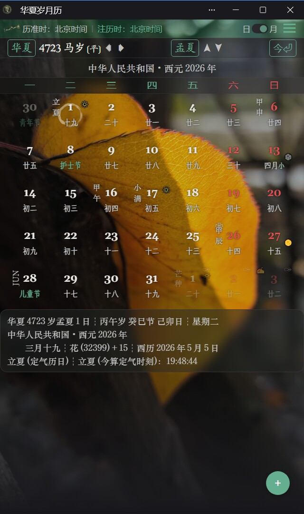
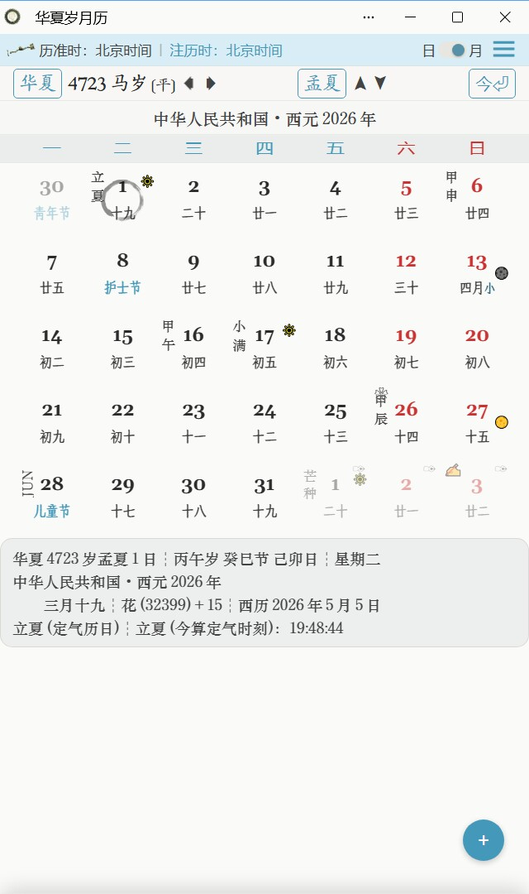

# 关于

## 可访问的地址

[华夏岁月历](https://hx.suiyue.li)

## 关于应用

这是一个PWA日历应用，是**华夏岁月历**的程序实现。

华夏岁月历由夏历增补节历而成，历法及相关概念与术语详见：[江俊.《历象授时·传承及补充——华夏岁月历》.哲学社会科学预印本平台.[PSSXiv:202606.04638]](https://zsyyb.cn/abs/202606.04638)；具体设定也可参考本应用源文件子目录 `/scripts` 下的 `JieLi.js` 、`XiaLi.js` 文件；粗略了解则可参考 `/pages` 下的 `LiFa_Jian.html` 文件（建议从应用内“关于应用”页面进入“华夏岁月历规则简略版”）。

本应用以节历为主历法，以夏历为副历法，并附注干支、西历、节庆民俗等附加信息。

在岁节栏点击纪年名可切换华夏/西元纪年，但只是简单的数值偏移（±2697），岁首尾均以华夏岁月历为准。华夏岁月历规定的华夏纪年符合数学规范，原生支持0和负数；西元纪年的负值为天文记法，前1年记0年、前2年记-1年，余类推。

本应用提供简单的笔记功能。笔记存储在浏览器存储内，环境支持时（如 Windows + Edge）可同时指定本地存储文件（单向同步保存——直接编辑本地文件需导入才能生效，否则会被应用的存储动作覆盖）。

笔记不会上传网络。如果没有指定本地存储文件，清除浏览器缓存、卸载浏览器等操作将导致笔记及个人设置**数据丢失**，建议经常导出备份——记笔记之前请**务必**先尝试导出节庆民俗列表或每年重复日列表，确保数据在当前浏览器中可正常导出。

## 实用警告

本应用之主历法——节历，并非一种公共通行历法。

**切勿实用于现实日程，以免因混淆现行历法而误事！**

## 截图

## 关于程序

本应用源代码托管在 [Gitee](https://gitee.com/suiyueli/suiyueli) / [Github](https://github.com/SuiYueLi/SuiYueLi) 平台，采用开源协议：[木兰宽松许可证，第2版](https://license.coscl.org.cn/MulanPSL2)。

日历编排、日期信息等历法实现程序均为手工编写；页面呈现部分则通过 AI 辅助完成（TRAE CN + GML-5.1）。

版本信息参见提交记录。

## 已知问题

- 手动更新有时误提示“更新失败”。
	- 权宜之计：再检查一下版本号，通常已更新成功。
- Windows 版 Edge 浏览器中，上下拖动日历格切换节月的滚动动画可能出现预期外的回滚视觉效果。
	- 权宜之计：不影响节月切换，忽视即可。
- 安卓设备的物理返回键或只能回退一层页面，第二次会导致应用退出。
	- 权宜之计：优先使用应用内的返回按钮。
- 在一些国产安卓浏览器中“添加到桌面”后，用桌面图标打开应用可能无法正常进行文件操作（打开、导入、导出）。
	- 权宜之计：需要进行文件操作时在浏览器中通过网址打开应用。

　 

*华夏 4723 岁 季夏 4 日 甲申、五月廿五，周四，*  
*版本 v1 完结。*  